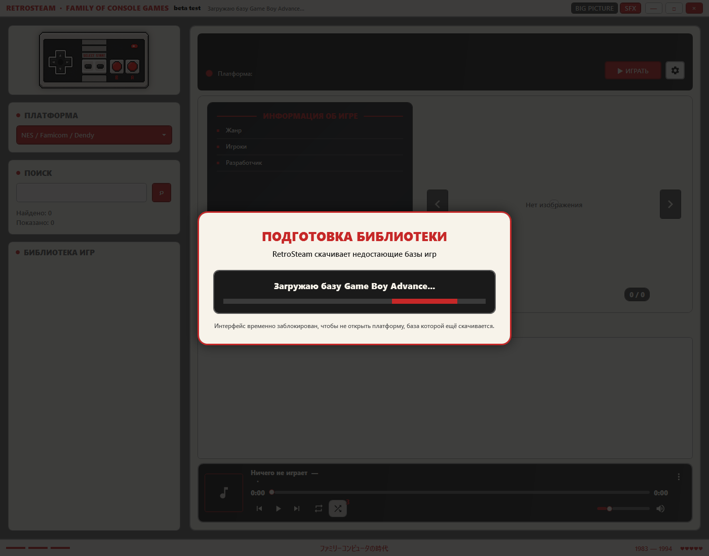
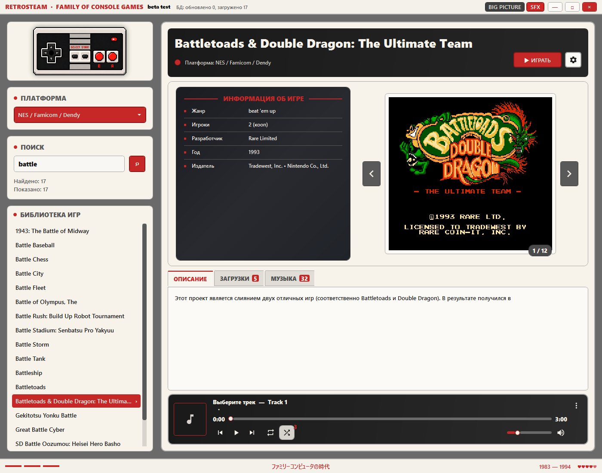
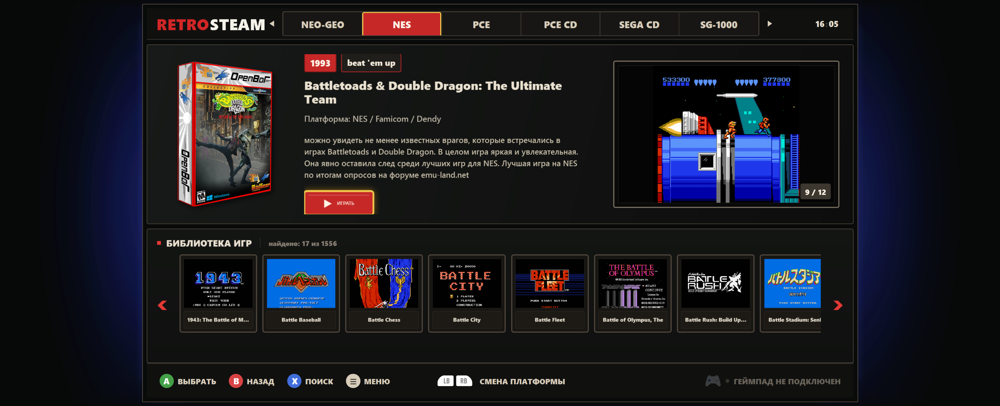

# RetroSteam: FOCG

**RetroSteam: FOCG** — Windows-приложение для просмотра и запуска библиотеки ретро-игр в интерфейсе, вдохновлённом классическими игровыми консолями.

Проект рассчитан на два сценария использования:

- обычный desktop-режим на ПК;
- Big Picture-режим для портативных Windows-консолей и управления с геймпада.

## Скриншоты

### Первичный запуск и загрузка баз



### Desktop-режим



### Big Picture-режим



## Beta-релиз

Текущая версия находится в стадии beta-тестирования.

В beta-сборке уже доступны:

- установщик для Windows x64;
- автоматическая загрузка баз игр при первом запуске;
- повторная докачка БД при ошибках соединения;
- desktop-интерфейс библиотеки;
- Big Picture-режим;
- обнаружение геймпада;
- запуск игр через BizHawk;
- автоматическая загрузка эмулятора при первом запуске игры;
- fullscreen-запуск эмулятора;
- плашка горячих клавиш поверх эмулятора;
- музыкальный плеер.

## Установка

Скачайте установщик из раздела **Releases**:

```text
RetroSteam.FOCG-win-Setup.exe

После первого запуска дождитесь загрузки баз игр.

Горячие клавиши во время игры
LB + RB + START — закрыть эмулятор
LB + RB + Y     — скрыть плашку подсказок
ALT + F4        — закрыть эмулятор с клавиатуры
Важное предупреждение

Это ранняя beta-версия. Возможны ошибки, недоработки интерфейса и проблемы совместимости с отдельными устройствами.

Установщик пока не подписан цифровым сертификатом, поэтому Windows SmartScreen может показать предупреждение.

Поддерживаемая платформа
Windows x64

Основной тестовый сценарий: ПК и портативные Windows-консоли, включая ROG Ally / ROG Ally X.